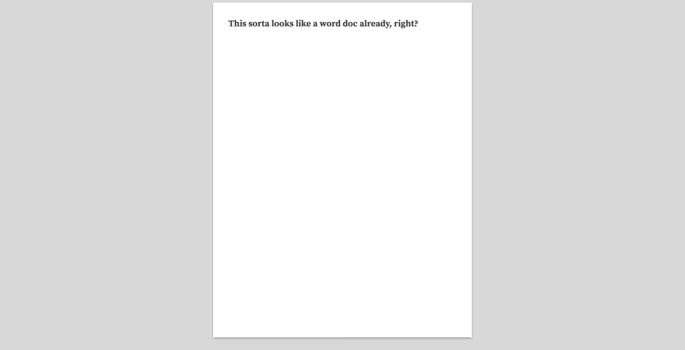

Standard word processors don't hold a candle to HTML and CSS when it comes to controlling the finer details of styling and layout. I've had difficulty fine-tuning my resume in a word processor, so I started using HTML and CSS to create and maintain my resume instead. I've found it to work a lot better overall, but there are a few helpful things to know before beginning the transition.

# Getting Started

First, a disclaimer: this guide is not meant to provide resume templates or styling advice. Rather, I'm detailing a process for handling a resume print layout in HTML/CSS. This includes setup, print styling, and a final PDF export.

## Wireframe

It's much easier to write HTML and CSS when working from a mockup or wireframe. I used an old resume from Word as my baseline, but you could just as easily mock something up in a free tool like [Adobe XD](https://www.adobe.com/products/xd.html) or [Figma](https://www.figma.com/) (Figma even supports print sizes by default).

If you already have content from a past resume ready to go (like I did), you can break out your design into sections and add the details later:


We don't have to adhere to the exact styling of a template or mockup, but it can be useful for organizing the overall layout.

## Setting up a "Canvas"

To better visualize your resume as you code, I'd recommend creating a "canvas" – an HTML container with the same proportions as your resume. By placing this container on an empty page, you'll get a view very similar to a typical word processor:



We can actually use physical measurement units in CSS (even though they end up [mapping to pixels anyway](https://css-tricks.com/the-lengths-of-css/)), so it was quite easy to set this canvas up:

```css
.canvas-container {
  margin: 0 auto; /* for centering, feel free to use flexbox or some other method*/
  box-sizing: border-box;
  padding: 0.5in; /* controls margins */
  width: 8.5in;
  height: 11in;
  background-color: white;
  box-shadow: 0 3px 8px -3px rgba(0, 0, 0, 0.7);
}
```

Here's what that might look like on a barebones page (use 0.5x or 0.25x zoom for the best effect):

<iframe height="350" style="width: 100%; margin-bottom: 1rem;" scrolling="no" title="Blank Document Canvas" src="https://codepen.io/nathanspenner/embed/wvBVWvr?height=348&theme-id=dark&default-tab=result" frameborder="no" allowtransparency="true" allowfullscreen="true">
  See the Pen <a href='https://codepen.io/nathanspenner/pen/wvBVWvr'>Blank Document Canvas</a> by Nathan Minchow
  (<a href='https://codepen.io/nathanspenner'>@nathanspenner</a>) on <a href='https://codepen.io'>CodePen</a>.
</iframe>

Use your canvas container to set default styles on your entire page, similar to defaults in a word processor. Other good properties to consider adding here are `line-height` and font properties like `font-size` and `font-family`.

# Layout and Content

Using your wireframe for reference, map out how you will divide your canvas space into sections of content. This is where tools like [Flexbox](https://developer.mozilla.org/en-US/docs/Glossary/Grid) and [Grid](https://developer.mozilla.org/en-US/docs/Glossary/Grid) will come in handy if your layout is more complex.

My setup was fairly straightforward: each area of my resume was broken into a `section` element. Whenever I had content spanning two columns, I used a grid to split them up:

```css
.multicolumn {
  display: grid;
  grid-template-columns: 1fr 1fr;
  gap: 1rem;
}
```

Here's what that looks like in practice:

<iframe height="350" style="width: 100%; margin-bottom: 1rem;" scrolling="no" title="Blank Document Canvas" src="https://codepen.io/nathanspenner/embed/povMyXK?height=371&theme-id=dark&default-tab=result" frameborder="no" allowtransparency="true" allowfullscreen="true">
  See the Pen <a href='https://codepen.io/nathanspenner/pen/povMyXK'>Blank Document Canvas</a> by Nathan Minchow
  (<a href='https://codepen.io/nathanspenner'>@nathanspenner</a>) on <a href='https://codepen.io'>CodePen</a>.
</iframe>

In my resume, I only needed a multicolumn layout for two sections, **Experience** and **Certifications / Skills**. I hid the content, but here's how those grids are situated on my current layout:


One added bonus of using something like `grid` is maintainability; I could very easily add another instance of work experience and have the grid automatically adjust without destroying the rest of my layout:


Apart from using `grid` in those two instances, everything else fit nicely into sections using [normal flow](https://developer.mozilla.org/en-US/docs/Learn/CSS/CSS_layout/Normal_Flow). Feel free to use whatever works best for you.

# Exporting

Most companies and recruiters won't accept an HTML page as a valid resume. Therefore, you'll want to export your page as a PDF. Browsers can do this readily via the Print command, but we'll need to do some adjustments to our CSS beforehand.

## Print Styles

We'll be taking advantage of the [print media query](https://developer.mozilla.org/en-US/docs/Web/CSS/@media) to style our exported page. It allows us to apply styles specifically when a browser attempts to print.

If you followed my advice of building everything inside a container, this should be a straightforward process. For simplicity, I made the entire `html` element's width and height match the print size of my container. You may also need to remove any margins (and box-shadows!) for elements between the `body` and your container, otherwise the added space might cause an extra page to render:

```css
@media print {
  html {
    height: 11in;
    width: 8.5in;
    overflow: hidden;
  }

  body {
    margin: 0;
  }

  .canvas-container {
    width: 100%;
    box-shadow: none;
  }
}
```

## Generating a PDF

With browser styles in place, we can use the browser's Print dialog to save our page as a PDF.

While I love Firefox, Blink's Print functionality tends to do a much better job of accurately exporting a page. I used Chrome for my final export – as detailed in the following instructions.

After opening the print dialog, set your Destination to "Save as PDF". Additionally, you'll want to adjust a few settings before saving the final result. Expand the "More settings" option and check the following:

- Color is enabled if you are using anything other than shades of gray
- Paper size is set to your preferred size (I used Letter throughout this guide)
- Margins should be set to None
- Scale should be set to 100
- Background Graphics are enabled


Go ahead and save the page. With that, you should have both an easily maintainable HTML resume and a PDF export to use for actual applications.

# Conclusion

I hope this guide was a helpful starting point in how to create a resume in HTML and CSS.

If you're curious for what my final result was, the source code for my current implementation is available [here](https://github.com/nspenner/portfolio/tree/master/pages/resume).
